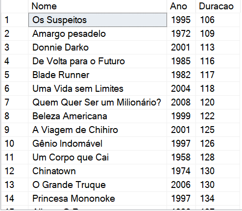
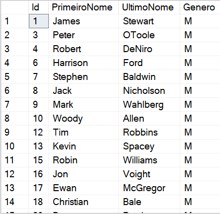

# Bootcamp Dio - Coding The Future Avanade .NET Developer - Banco de Dados(SGBD)

## Desafio de projeto
Apresentar os conhecimentos adquiridos no módulo de banco de dados,para  criar um Banco de Dados em Microsoft Sql Server e realizar algumas consultas conforme a seguir.

## Contexto
Sou responsável pelo banco de dados de um site de filmes, onde são armazenados dados sobre os filmes e seus atores. Sendo assim, quero realizar uma consulta no banco de dados com o objetivo de trazer alguns dados para análises.

## Proposta
Tendo como foco realizar 12 consultas ao banco de dados, cada uma retornando um tipo de informação.
Segue a modelagem do Banco de Dados:

As tabelas sao descritas conforme a seguir:

**Filmes**

Tabela responsável por armazenar informações dos filmes.

**Atores**

Tabela responsável por armazenar informações dos atores.

**Generos**

Tabela responsável por armazenar os gêneros dos filmes.

**ElencoFilme**

Tabela responsável por representar um relacionamento do tipo muitos para muitos entre filmes e atores, ou seja, um ator pode trabalhar em muitos filmes, e filmes
podem ter muitos atores.

**FilmesGenero**

Tabela responsável por representar um relacionamento do tipo muitos para muitos entre filmes e gêneros, ou seja, um filme pode ter mais de um gênero, e um genêro pode fazer parte de muitos filmes.

## Preparando o o ambiente.
  
 Na pasta Banco de Dados encontra-se o arquivo docker-compose.yml resposável por fazer a instalção do Microsoft SQL Server em um container no docker.
     Para isso o docker deve estar instalado na máquina previamente, segue link caso não tenha instalado:

     
[Docker](https://www.docker.com/products/docker-desktop)
                  
   
 Basta entrar na pasta Banco de Dados onde esta o aqruivo docker-compose.yml, após clonar ou fazer download deste projeto e executar o seguinte comando no terminal:
      
             
docker-compose up -d

      
  E container com a instância do SQL será criada e inicada em seguida.

  
Para acessar a instância criada,realize o download do SQL Server Management Studio (SSMS)no link abaixo.Após realizar o dwnload e a instalação, abra o  SQL Server Management Studio e preencha os campos como mostra na imagem baixo:Obs: A senha utilizada consta no arquivo de instalação docker-compose.

[Download SQL Server Management Studio](https://learn.microsoft.com/en-us/sql/ssms/download-sql-server-management-studio-ssms?view=sql-server-ver16)

 
 Pronto ao se concetar com a instância no container docker poderá seguir com os passos seguintes.
      

## Preparando o banco de dados
Você deverá executar o arquivo **Script -Criação do Banco de Dados e Carga de Dados.sql** no Microsoft SQL Server, presente na pasta Banco de Dados deste repositório. Esse script contém comandos para a criação do Banco chamado **Filmes**, juntamente com outros comandos para criação dos realacionamentos entre as tabelas ElencoFilme,FilmeGenero.Além de conter comandos para inserção de alguns dados para que possamos realizar as consultas.

## Objetivo
Cada instrução em sql a seguir deve retornar os dados mostrados abaixo. Abaixo de cada pedido tem o retorno esperado. O retorno deve ser igual ao da imagem.

## 1 - Buscar o nome e ano dos filmes

## 2 - Buscar o nome e ano dos filmes, ordenados por ordem crescente pelo ano

## 3 - Buscar pelo filme de volta para o futuro, trazendo o nome, ano e a duração

## 4 - Buscar os filmes lançados em 1997

## 5 - Buscar os filmes lançados APÓS o ano 2000

## 6 - Buscar os filmes com a duracao maior que 100 e menor que 150, ordenando pela duracao em ordem crescente

## 7 - Buscar a quantidade de filmes lançadas no ano, agrupando por ano, ordenando pela duracao em ordem decrescente

## 8 - Buscar os Atores do gênero masculino, retornando o PrimeiroNome, UltimoNome

## 9 - Buscar os Atores do gênero feminino, retornando o PrimeiroNome, UltimoNome, e ordenando pelo PrimeiroNome

## 10 - Buscar o nome do filme e o gênero

## 11 - Buscar o nome do filme e o gênero do tipo "Mistério"

## 12 - Buscar o nome do filme e os atores, trazendo o PrimeiroNome, UltimoNome e seu Papel

